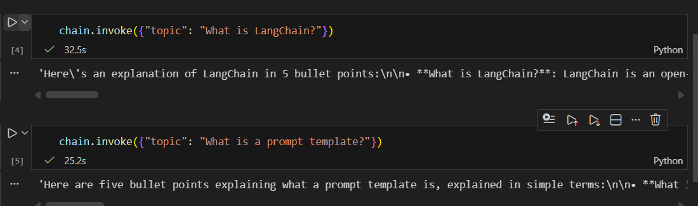
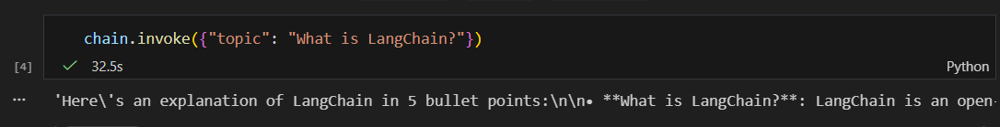

# langchain-llm-chain-ollama
LLM
# Project Title
LangChain LLM Chain (Ollama) — Repo 1

## One Paragraph of project description goes here
This project demonstrates a **basic LangChain LLM Chain** using **Ollama** as a local LLM provider. It follows the core idea of the LangChain quickstart: create a prompt template, connect it to an LLM, and invoke the chain to generate responses.

# Getting Started
These instructions will get you a copy of the project up and running on your local machine for development and testing purposes. See deployment for notes on how to deploy the project on a live system.

# Prerequisites
What things you need to install the software and how to install them

- **Python 3.10+**
  - Download: https://www.python.org/downloads/
- **Git**
  - Download: https://git-scm.com/downloads
- **Ollama** (local LLM runtime)
  - Download: https://ollama.com
  - Verify:
    ```bash
    ollama --version
    ```
- **A local Ollama model**
  - Example:
    ```bash
    ollama pull llama3.1
    ```

# Give examples
Example of what this project does (after running the notebook):
- Input: `What is LangChain?`
- Output: A short explanation in bullet points generated by the local model.


# Installing
A step by step series of examples that tell you how to get a development env running

## Say what the step will be
Clone the repository:

### Give the example
```bash
git clone <YOUR_REPO_URL>
cd <YOUR_REPO_FOLDER>
```

## And repeat
Create and activate a virtual environment:

### Give the example
**macOS / Linux**
```bash
python -m venv .venv
source .venv/bin/activate
```

**Windows PowerShell**
```powershell
py -m venv .venv
.\.venv\Scripts\Activate.ps1
```

## until finished
Install dependencies:

### Give the example
```bash
pip install -r requirements.txt
```

(Optional) Create an environment file (if you want to set a model name):
```bash
copy .env.example .env   # Windows
# cp .env.example .env   # macOS/Linux
```

Start Jupyter Notebook:

### Give the example
```bash
jupyter notebook
```

Open and run:
- `LLM.ipynb`

## End with an example of getting some data out of the system or using it for a little demo
In the notebook, run a cell like:

```python
chain.invoke({"topic": "Explain RAG in simple terms"})
```

# Running the tests
Explain how to run the automated tests for this system

This project does not include automated unit tests. Functionality is validated by running the notebook cells end-to-end.

## Break down into end to end tests
Explain what these tests test and why

End-to-end validation covers:
- Prompt template creation
- LLM connection through Ollama
- Chain invocation and output parsing

### Give an example
Run the notebook cell that calls:

```python
chain.invoke({"topic": "What is LangChain?"})
```

Response:
'Here\'s an explanation of LangChain in 5 bullet points:\n\n• **What is LangChain?**: LangChain is an open-source framework that enables developers to build conversational AI applications using natural language processing (NLP) and machine learning.\n\n• **Key Features**: LangChain provides a set of tools and libraries for building, training, and deploying conversational models. It supports various NLP tasks such as text classification, sentiment analysis, and question-answering.\n\n• **Modular Architecture**: LangChain\'s modular architecture allows developers to create custom workflows by combining pre-built components, called "blocks". These blocks can be connected in different ways to build complex conversational flows.\n\n• **Integration with Other Tools**: LangChain is designed to work seamlessly with popular AI and NLP libraries such as Hugging Face Transformers, PyTorch, and TensorFlow. This makes it easy for developers to integrate LangChain into their existing projects.\n\n• **Use Cases**: LangChain can be used in a variety of applications, including chatbots, virtual assistants, customer service platforms, and more. It\'s particularly useful for building conversational interfaces that require complex reasoning and decision-making capabilities.'

## And coding style tests
Explain what these tests test and why

No automated linting is included. The notebook focuses on clarity and reproducibility for academic purposes.

### Give an example
(Manual check) Ensure imports run without errors and the chain executes successfully.

# Deployment
Add additional notes about how to deploy this on a live system

This project is designed for local execution. For a live deployment you would typically:
- Wrap the chain behind an API (e.g., FastAPI)
- Run Ollama on a server (or switch to a hosted LLM provider)
- Add logging, monitoring, and authentication

# Built With
- LangChain — LLM application framework
- Ollama — Local LLM runtime
- Jupyter Notebook — Interactive execution environment
- Python — Programming language


# Versioning
We use SemVer for versioning. For the versions available, see the tags on this repository.

Current version: 1.0.0

# Authors
Diego Rozo — Initial work


# License
This project is licensed under the MIT License.

# Acknowledgments
- LangChain documentation
- Ollama documentation
- Open-source LLM community